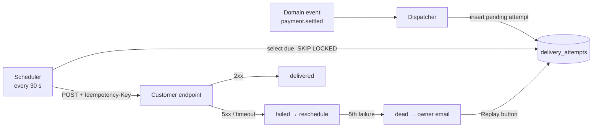

# Architecture note: outbound webhook delivery

**Audience:** the integrations team and the customer success lead · **Scope:** how an event leaves Ledger API and reaches a customer, after the retry work ships.

## The flow



## Assumptions

- Customer endpoints are HTTPS and answer within 10 seconds. Anything slower is treated as a failure.
- Events are small (under 64 KB) and carry no secrets; the payload is signed with the account's webhook secret, not encrypted.
- A single Postgres database is fine for the current volume (~40k events/day). The queue table lives beside the events, so enqueueing is transactional with the event itself.

## Failure paths

| Failure | What happens | Who notices |
| --- | --- | --- |
| Endpoint returns 5xx or times out | Attempt marked `failed`, rescheduled with backoff (1 min → 12 h) | Nobody, by design |
| Endpoint returns 4xx | Attempt marked `dead` immediately — retrying a bad request is pointless | Account owner email |
| 5 consecutive failures | `dead` + owner email; replayable from the dashboard | Account owner |
| Scheduler down | Attempts pile up as `pending`; alert fires when the oldest due attempt is over 5 minutes old | On-call |
| Customer endpoint not idempotent | Possible double-processing on retry | Customer — mitigated by the `Idempotency-Key` header |

## What the customer receives

```http
POST /hooks/ledger HTTP/1.1
Host: customer.example
Content-Type: application/json
Idempotency-Key: evt_01J9X4K2P7
X-Ledger-Signature: sha256=3b1f…

{"id":"evt_01J9X4K2P7","type":"payment.settled","data":{"amount":12900,"currency":"EUR"}}
```

Verifying the signature is three lines in most languages:

```ts
const expected = createHmac('sha256', secret).update(rawBody).digest('hex');
if (!timingSafeEqual(Buffer.from(expected), Buffer.from(header.slice(7)))) throw new Error('bad signature');
```

## Out of scope

Fan-out to multiple endpoints per account, and event ordering guarantees. Both are tracked separately.
