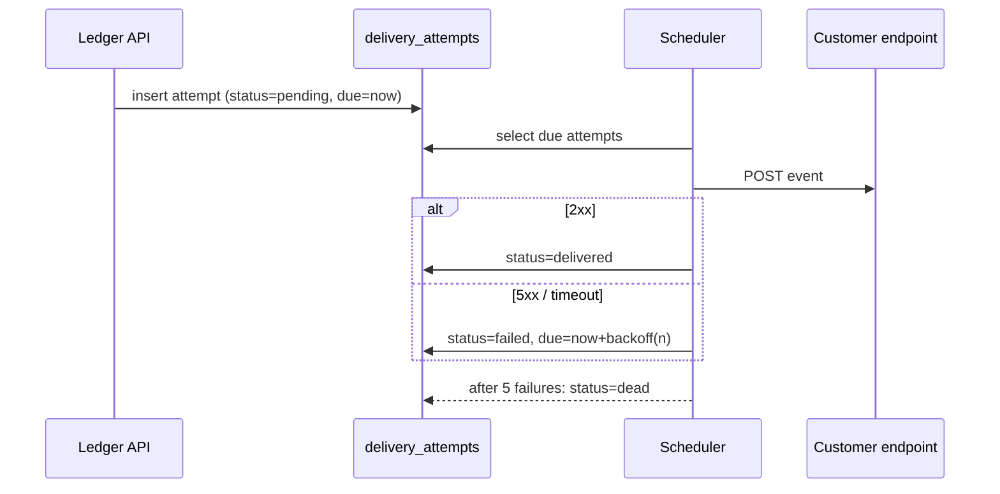

# Implementation plan: webhook delivery retries

**Repository:** `acme/ledger-api` · **Branch:** `feat/webhook-retries` · **Author:** Claude Code, prompted by Priya · **Status:** waiting for review

## Decision needed

Approve **Option B (durable queue with exponential backoff)** or send back with changes by **Thursday**. The change touches the payments webhook path, so I want a second pair of eyes before implementation starts.

## Problem

`POST /internal/webhooks/dispatch` fires each event at the customer's endpoint exactly once. If the customer's server is down for even a few seconds, the event is lost and support opens a ticket to replay it by hand. Last month: 41 tickets, median 3 hours to resolution.

## Proposed behavior

1. Every delivery attempt is recorded with a status and the next retry time.
2. Failed deliveries retry with exponential backoff: 1 min, 5 min, 30 min, 2 h, 12 h (5 attempts, ~15 h total).
3. After the final failure the event is marked `dead` and an email goes to the account owner.
4. Customers can replay a `dead` event from the dashboard; support no longer touches the database.

## Alternatives considered

| Option | What it is | Why not |
| --- | --- | --- |
| A. Retry inline | Loop with `sleep` inside the request handler | Blocks a worker for up to 15 h; retries die with a deploy |
| **B. Durable queue** | Persist attempts, a scheduler polls due retries | Chosen — survives deploys, observable, cheap to build on Postgres |
| C. Third-party (Svix, Hookdeck) | Outsource delivery | Adds a vendor to the payments path; revisit at 10× volume |

## Sequence



## Implementation steps

1. **Migration** — new table `delivery_attempts (id, event_id, attempt, status, due_at, response_code, created_at)`, index on `(status, due_at)`.
2. **Enqueue** — `dispatch` inserts a pending attempt instead of calling the endpoint directly.
3. **Scheduler** — a cron every 30 s: `SELECT ... WHERE status='pending' AND due_at <= now() FOR UPDATE SKIP LOCKED LIMIT 100`.
4. **Backoff** — `backoff(n) = [60, 300, 1800, 7200, 43200][n]` seconds; jitter ±10 %.
5. **Dead letter** — on the 5th failure set `dead`, send the owner email through the existing `notifications` service.
6. **Dashboard** — "Replay" button calls `POST /events/:id/replay`, which inserts a fresh attempt.

```ts
// scheduler/deliver.ts (sketch)
export async function deliver(attempt: Attempt) {
  const res = await fetch(attempt.url, { method: 'POST', body: attempt.payload, signal: AbortSignal.timeout(10_000) });
  if (res.ok) return markDelivered(attempt.id, res.status);
  const n = attempt.attempt + 1;
  return n >= 5 ? markDead(attempt.id, res.status) : reschedule(attempt.id, n, backoff(n));
}
```

## Verification

- Unit: backoff schedule, dead-letter threshold, replay creates attempt #1.
- Integration: a mock endpoint that fails twice then succeeds → three rows, final status `delivered`.
- Staging: point the sandbox account at a deliberately down URL, confirm the owner email arrives after ~15 h (use a shortened schedule behind a flag).

## Risks and open questions

- Retrying non-idempotent customer endpoints could double-process. Mitigation: send an `Idempotency-Key` header equal to the event id; document it.
- Should `dead` events auto-replay when the customer's endpoint comes back? Proposal: no, keep it explicit.

## Rollout

Feature flag `webhook_retries` per account. Enable for internal accounts first, then 10 % of customers, then everyone over two weeks.
